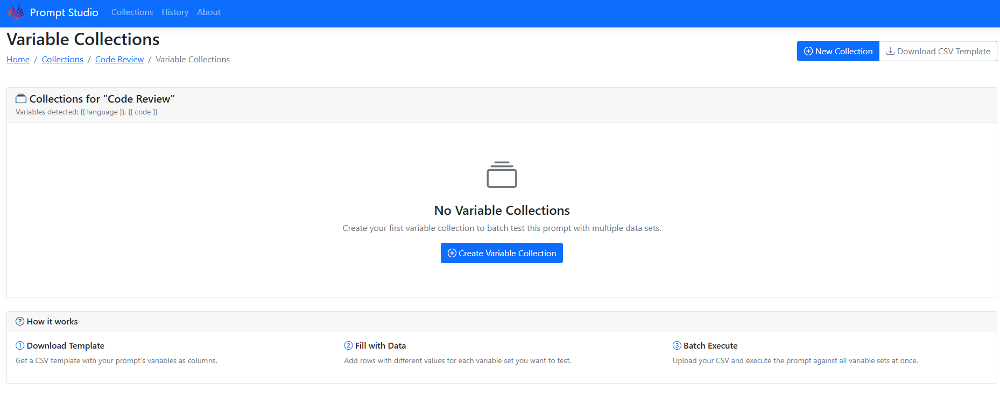

> **Professional AI Prompt Management** - Organize, test, and manage your AI prompts with ease.

Prompt Studio is a clean, modern web application that helps you organize your AI prompts into collections, define variables for dynamic content, and test prompts with different values - just like professional API testing tools do for web services.

## ✨ Features

- **📁 Collections**: Organize prompts into logical groups
- **⚡ Dynamic Variables**: Use `{{variable}}` syntax for reusable prompts
- **🧪 Test & Execute**: Run prompts with different variable values
- **📊 Execution History**: Track when and how prompts were used
- **🎨 Modern UI**: Clean, professional interface
- **🔗 Variable Auto-Detection**: Automatically extracts variables from prompt content
- **📋 Variable Collections**: Batch execute prompts with CSV data sets - like data-driven testing in professional API tools
- **📥 CSV Templates**: Download properly formatted CSV templates for your prompt variables
- **🚀 Batch Processing**: Execute prompts against multiple variable sets simultaneously
- **📤 Results Export**: Export comprehensive batch execution results to CSV
- **🤖 MCP Integration**: Model Context Protocol server for AI agent integration (GitHub Copilot, Claude Desktop, etc.)
- **🔌 API Access**: RESTful API endpoints for programmatic access to all functionality

## 🏗️ Architecture

Built with **Clean Architecture** principles:

```
PromptStudio/
├── Domain/              # Core business entities
│   ├── Collection.cs
│   ├── PromptTemplate.cs
│   ├── PromptVariable.cs
│   ├── PromptExecution.cs
│   └── VariableCollection.cs
├── Services/            # Business logic
│   └── PromptService.cs
├── Data/                # Entity Framework
│   └── PromptStudioDbContext.cs
└── Pages/               # Razor Pages UI
    ├── Collections/
    ├── Prompts/
    └── VariableCollections/
```

## 🚀 Quick Start

### Prerequisites

- [.NET 8 SDK](https://dotnet.microsoft.com/download/dotnet/8.0)
- SQL Server (Docker or local)

### Setup with Docker SQL Server

1. **Start SQL Server in Docker**:
   ```bash
   docker pull mcr.microsoft.com/mssql/server:2019-latest
   docker run -e 'ACCEPT_EULA=Y' -e 'SA_PASSWORD=YourPassword123!' -p 1433:1433 --name sqlserver -d mcr.microsoft.com/mssql/server:2019-latest
   ```

2. **Clone and Run**:
   ```bash
   git clone <your-repo>
   cd PromptStudio
   dotnet run
   ```

3. **Open Browser**: Navigate to `http://localhost:5131`

## 🤖 MCP Server Setup (GitHub Copilot Integration)

PromptStudio includes a Model Context Protocol (MCP) server that enables AI agents like GitHub Copilot to access and manage your prompts programmatically.

### Prerequisites for MCP Server

- [Node.js 18+](https://nodejs.org/) (for MCP server)
- PromptStudio application running (see setup above)

### Install and Run MCP Server

1. **Navigate to MCP server directory**:
   ```bash
   cd mcp-server
   ```

2. **Install dependencies**:
   ```bash
   npm install
   ```

3. **Build the TypeScript code**:
   ```bash
   npm run build
   ```

4. **Start the MCP server**:
   ```bash
   npm start
   ```

   Or for development with auto-reload:
   ```bash
   npm run dev
   ```

### Configure with GitHub Copilot

To use the MCP server with GitHub Copilot, add this configuration to your VS Code settings:

1. Open VS Code Settings (JSON)
2. Add the MCP server configuration:

```json
{
  "github.copilot.chat.experimental.codeGeneration.instructions": [
    {
      "text": "You have access to PromptStudio via MCP server for professional prompt management."
    }
  ],
  "mcp.servers": {
    "promptstudio": {
      "command": "node",
      "args": ["path/to/your/mcp-server/dist/index.js"],
      "env": {
        "PROMPTSTUDIO_BASE_URL": "http://localhost:5131"
      }
    }
  }
}
```

### Configure with Claude Desktop

Add to your Claude Desktop MCP configuration file:

**macOS**: `~/Library/Application Support/Claude/claude_desktop_config.json`
**Windows**: `%APPDATA%\Claude\claude_desktop_config.json`

```json
{
  "mcpServers": {
    "promptstudio": {
      "command": "node",
      "args": ["path/to/your/mcp-server/dist/index.js"],
      "env": {
        "PROMPTSTUDIO_BASE_URL": "http://localhost:5131"
      }
    }
  }
}
```

### MCP Tools Available

The MCP server provides these tools for AI agents:

- **`csv_template_generate`** - Generate CSV templates for prompt variables
- **`variable_collection_create_from_csv`** - Create variable collections from CSV data
- **`variable_collections_list`** - List variable collections for prompts
- **`prompt_execute`** - Execute prompts with variables
- **`batch_execute`** - Batch execute prompts with variable collections

### Example MCP Usage

Once configured, you can ask GitHub Copilot or Claude:

> "Generate a CSV template for prompt ID 1 in PromptStudio"

> "Create a variable collection from this CSV data for my code review prompt"

> "List all variable collections for prompt template 2"

The AI agent will use the MCP server to interact with your PromptStudio instance automatically.

### Troubleshooting MCP Setup

1. **Ensure PromptStudio is running** on http://localhost:5131
2. **Check Node.js version**: `node --version` (must be 18+)
3. **Verify MCP server build**: Check `dist/index.js` exists after `npm run build`
4. **Test API endpoints**: Visit http://localhost:5131/api/mcp/prompts in browser
5. **Check logs**: MCP server logs will show connection status and errors

### First Steps

1. **Create a Collection** - Like a project folder for related prompts
2. **Add Prompts** - Write prompts with `{{variables}}` for dynamic content
3. **Execute & Test** - Run prompts with different variable values
4. **Batch Processing** - Create Variable Collections for testing multiple scenarios
5. **Download Templates** - Get CSV templates with your prompt variables
6. **Upload Data Sets** - Fill CSV with multiple test scenarios and upload
7. **Batch Execute** - Run prompts against all variable sets simultaneously
8. **Export Results** - Download comprehensive results for analysis

## 📝 Example Prompts

### Code Review
```
Please review the following {{language}} code for {{focus_area}}:

```{{language}}
{{code}}
```

Focus on:
- Code quality
- Performance  
- Security
- Best practices
```

### Content Writing
```
Write a {{tone}} {{content_type}} about {{topic}} for {{audience}}.

Requirements:
- Length: {{length}}
- Include: {{key_points}}
- Avoid: {{avoid_topics}}
```

### Batch Testing with Variable Collections

Create a CSV file to test multiple scenarios at once:

**CSV Template** (auto-generated from your prompt):
```csv
language,code
javascript,"function greet(name) { return 'Hello ' + name; }"
python,"def greet(name): return f'Hello {name}'"
java,"public class Greeting { public static String greet(String name) { return ""Hello "" + name; } }"
typescript,"function greet(name: string): string { return `Hello ${name}`; }"
```

**Workflow**:
1. **Download CSV Template** → Get properly formatted headers
2. **Fill with Data** → Add multiple test scenarios in Excel/editor  
3. **Upload & Execute** → Batch process all variable sets
4. **Export Results** → Download comprehensive results with resolved prompts

## 📸 Screenshots

### Main Dashboard

*Clean, modern dashboard showing collections overview with prompt counts and recent activity*

### Creating New Prompts

*Intuitive prompt creation interface with variable auto-detection and syntax highlighting*

### Prompt Execution

*Execute prompts with variable substitution and see resolved output in real-time*

### Variable Collections Management

*Manage multiple variable sets for batch testing and data-driven prompt execution*

### Batch Variable Collection

*Advanced batch processing interface for executing prompts against multiple variable collections simultaneously*

### CSV Import for Variable Collections

*Import CSV data to create variable collections - Excel/CSV workflow integration for enterprise-scale testing*

### MCP Integration with AI Assistants

*Model Context Protocol integration enables AI assistants like GitHub Copilot and Claude Desktop to access PromptStudio functionality through natural language commands*

## 🔥 Variable Collections - Batch Processing Power

**Transform single prompt testing into enterprise-scale batch processing!**

### Key Benefits
- **10x Faster Testing** - Process hundreds of scenarios vs. manual one-by-one execution
- **Systematic Quality Assurance** - Ensure prompts work across diverse scenarios
- **Data-Driven Insights** - Export results for analysis and optimization
- **Excel/CSV Integration** - Use familiar tools to manage test data

### How It Works

1. **Create a Prompt** with variables like `{{language}}` and `{{code}}`

2. **Download CSV Template** - Auto-generated with correct headers:
   ```csv
   language,code
   ```

3. **Fill with Test Data** in Excel or any CSV editor:
   ```csv
   language,code
   javascript,"function hello() { console.log('Hello World'); }"
   python,"def hello(): print('Hello World')"
   java,"public class Hello { public static void main(String[] args) { System.out.println(""Hello World""); } }"
   ```

4. **Upload & Execute** - Process all rows automatically

5. **Export Results** - Get comprehensive CSV with:
   - Original variables for each test case
   - Resolved prompts with variables substituted
   - Execution metadata and timestamps
   - Success/failure status for each scenario

### Perfect For
- **A/B Testing** - Compare prompt variations across multiple inputs
- **Quality Assurance** - Test prompts against edge cases and diverse scenarios  
- **Data Processing** - Batch process large datasets through AI workflows
- **Performance Testing** - Validate prompt performance at scale

## 🎯 Use Cases

- **Development Teams**: Standardize code review prompts, batch test across multiple codebases
- **Content Creators**: Template-driven content generation with A/B testing scenarios
- **Support Teams**: Consistent customer response templates with variable customer data
- **Researchers**: Structured data analysis prompts with batch data processing
- **Educators**: Reusable teaching and assessment prompts with student cohort testing
- **QA Teams**: Systematic prompt testing across diverse scenarios and edge cases
- **Data Scientists**: Batch process datasets through AI models with variable parameters

## 🛠️ Technology Stack

- **Backend**: ASP.NET Core 8, Entity Framework Core
- **Frontend**: Razor Pages, Bootstrap 5, Bootstrap Icons
- **Database**: SQL Server
- **Architecture**: Clean Architecture, Repository Pattern

## 🔧 Configuration

Update `appsettings.json` with your database connection:

```json
{
  "ConnectionStrings": {
    "DefaultConnection": "Server=localhost,1433;Database=PromptStudio;User Id=sa;Password=YourPassword123!;TrustServerCertificate=true;"
  }
}
```

## 📊 Database Schema

```sql
Collections (id, name, description, created_at, updated_at)
├── PromptTemplates (id, collection_id, name, description, content, created_at, updated_at)
    ├── PromptVariables (id, template_id, name, description, default_value, type, created_at)
    ├── VariableCollections (id, template_id, name, description, variable_sets_json, created_at, updated_at)
    └── PromptExecutions (id, template_id, variable_collection_id, resolved_prompt, variable_values, executed_at, ...)
```

## 🚧 Roadmap

- [x] **Variable Collections** - Batch execute prompts with CSV data sets ✅
- [x] **CSV Templates** - Auto-generate properly formatted CSV templates ✅  
- [x] **Batch Processing** - Execute multiple variable sets simultaneously ✅
- [x] **Results Export** - Export comprehensive execution results ✅
- [x] **MCP Integration** - Model Context Protocol server for AI agent access ✅
- [x] **API Endpoints** - RESTful API for programmatic access ✅
- [ ] **AI Provider Integration** - Direct integration with OpenAI, Claude, etc.
- [ ] **Prompt Sharing** - Import/export collections
- [ ] **Team Collaboration** - Share collections with team members
- [ ] **Advanced Variables** - File uploads, dropdowns, validation
- [ ] **Analytics** - Usage statistics and prompt performance
- [ ] **Enhanced MCP Tools** - More AI agent capabilities

## 🤝 Contributing

1. Fork the repository
2. Create a feature branch: `git checkout -b feature/amazing-feature`
3. Commit changes: `git commit -m 'Add amazing feature'`
4. Push to branch: `git push origin feature/amazing-feature`
5. Open a Pull Request

## 📄 License

This project is licensed under the MIT License - see the [LICENSE](LICENSE) file for details.

## 🙏 Acknowledgments

- Inspired by professional API testing tools and modern development workflows
- Built with modern web development best practices
- Designed for the AI-powered development era

---

**Made with ❤️ for the AI community**

*Simplifying prompt management, one variable at a time.*
